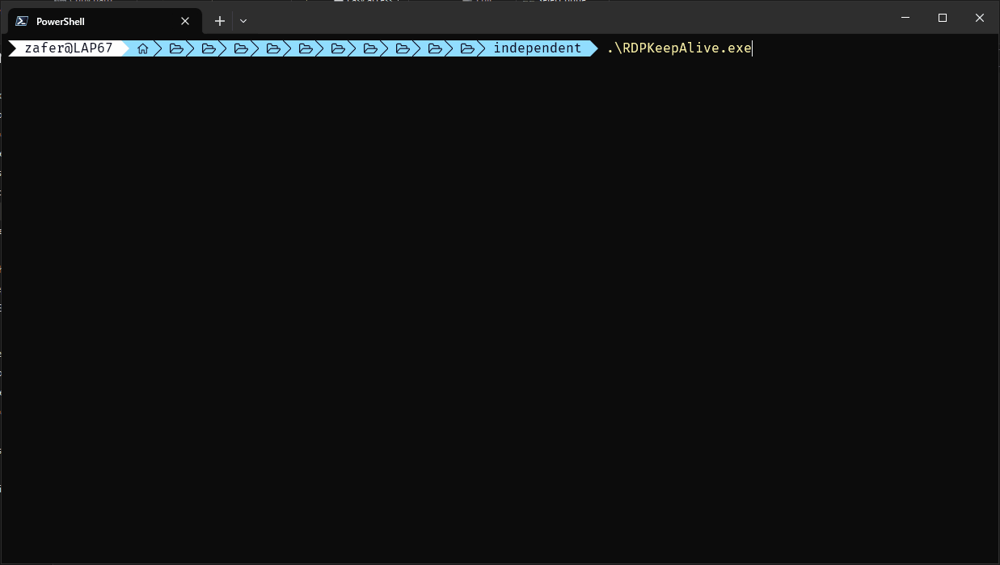

# RDPKeepALive

 Simulates RDP activity to keep idle RDP sessions alive with minor tweaks.

 Based on [ImAlive](https://github.com/ryanries/ImAlive).

## Usage

```shell
RDPKeepAlive.exe [/v]

 /v: Verbose
```

## Assessment

### Pros

- Captures RDCMAN as well as MSTSC
- Uses CTRL+C to exit, in order to prevent accidents
- Retains the window order (with ImAlive, the RDP client gets moved just behind the topmost window)

### Cons

- Image size is larger

## Basics

 
